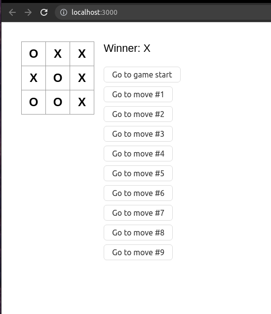

# Tic toc toe to learning more about React App

## TAG using-pros-and-states

- Learned props
- Components as functions
- Components as classes
- Set state and passing to another component
- Inserting style and component in another component
- For learned more.. the app was created to use TSX -> typescript with XML form

## TAG using-zustand

- Learned how to pass state to pro as directment or indirectment passing as callback
- Learned Zustand how to create a store and use the set state
- Afert create the store using the Zustand, learned how to use the store to get and set the store
  
